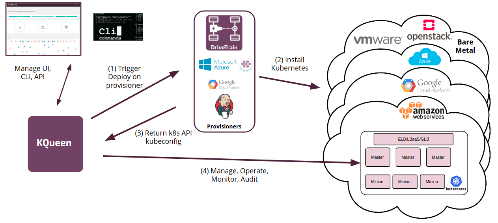

# Rationale

Kubernetes is today's probably the most promising container orchestration platform and it is gaining huge momentum. There are many different installation tools and hosted solutions:

* [Kubespray](https://github.com/kubernetes-incubator/kubespray)
* [Kubeadm](https://kubernetes.io/docs/setup/independent/create-cluster-kubeadm/)
* [Kubernetes Salt formula](https://github.com/salt-formulas/salt-formula-kubernetes)

* [Google Container engine](https://cloud.google.com/container-engine)
* [Azure Container Service](https://azure.microsoft.com/en-us/services/container-service/)

There is no need to develop new installation method because we already have many sufficient solutions and Kubernetes instllation isn't a rocket science.
However, there are still customers strugling to integrate Kubernetes because of missing solution for complex orchestration of multiple clusters. In this document we aim to address these problems and propose architecture.

## User stories

It's important to understand what we're trying to achieve with KQueen. Consider these user stories:

* **I'm application developer** and I'd like to have a tool to quickly spin-up the cluster and run my application on it. I have multiple applications and need to have multiple clusters for different application. It would be nice to have a possibility to run diffirent application versions in on cluster.

* **I'm KaaS administrator** and I need be able to manage all the clusters for our internal customers. I need to list then, control resources and get basic overview about each cluster. I can do administration manualy but I'd like to be able to kill some dead minions and replace them easily. Autoscaling clusters (with predefined range) would be a nice bonus.

These goals lead to specific design principles explained in the next section.

## Design Principles

When it comes to KQueen, we adheres to the following design principles on the infrastructure management layer:

* **Kubernetes as a Service environment deployment:** Provide a multi-tenant self-service portal for k8s cluster provisioning.
* **Operations:** Focus on the audit, visibility, and security of Kubernetes clusters, in addition to actual operations.
* **Update and Upgrade:** Automate updating and upgrading of clusters..
* **Multi-Cloud Orchestration:** Support the same abstraction layer for any public, private, or bare metal provider.
* **Platform Agnostic Deployment** (any Kubernetes cluster): Enable provisioning of a Kubernetes cluster by various community installers/provisioners, including those with customizations. Do not provide a black box with a strict installation procedure.
* **Open, Zero Lock-in Deployment:** Provide a pure-play open source solution without any closed source.

## Architecture

We have one central backend service (called *queen*) and this service listens for user requests (via API) and can orchestrate and operate clusters.

### Workflow Diagram

KQueen supplies the backend API for provider-agnostic cluster management. It enables access from the UI, CLI, or API, and manages provisioning of Kubernetes clusters. It uses the following workflow:

1. Trigger deployment on the provisioner, enabling KQueen to use various provisioners (AKS, GKE, Jenkins) for Kubernetes clusters. For instance there can be used the Jenkins provisioner to trigger installation of Kubernetes.
2. The provisioner installs the Kubernetes cluster using the specific provider.
3. The provisioner returns the Kubernetes kubeconfig and API endpoint. This config is stored in the KQueen backend (etcd).
4. KQueen manages, operates, monitors, and audits the Kubernetes clusters. It reads all information from the API and displays it as a simple overview visualization. KQueen can also be extended by adding other audit components.

### Required actions - MVP

* **Create cluster** - This action will be used to deploy new clusters. However, *queen* service don't deploy cluster on it's own but I uses another service (Jenkins, GKE, ..) to create this cluster.
* **Read cluster information** - Read information about new (and existing) cluster and provide this information to users and administrators. This information must include endpoint for Kubernetes API server and all required credentials (token, basic auth or certificates)
* **Deploy application** - This will connect to cluster and deploy the application. TODO: define format (apply YAMLs, Helm, ...)
* **Delete cluster** - destroy the cluster

### Additional actions

* **Check** - read cluster information and give information about node usage and running workload
* **Scale** - add or remove minions
* **Backup** - backup resources in cluster and provide guidance for PV backup
* **Update** - install newer version of Kubernetes
* **Autoscale** - watch Kubernetes scheduler or pods and start new minions when all existing minions are fully utilized
* **Manage addons** - enable or disable cluster addons

